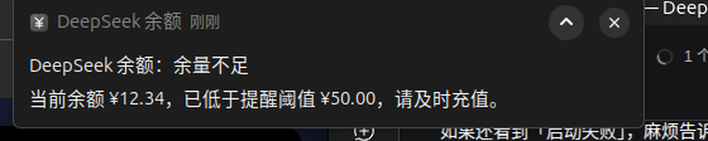

# DeepSeek 余额指示器（Ubuntu 顶栏）

[](https://github.com/Zhong-master/DeepSeek-Cost/actions/workflows/tests.yml)
[](LICENSE)
[](#依赖)
[](../../releases/latest)

## 项目介绍

**不用打开网页、不用敲命令，抬头就能看到 DeepSeek 还剩多少钱、今天花了多少。**

`deepseek-cost` 是一个跑在 Ubuntu/GNOME **系统栏右侧**的原生桌面指示器。它把余额与今日用量
直接渲染成彩色文字贴在顶栏上：

* 💰 **余额**：绿色 `¥123.45` 正常；低于阈值变红；数据过期变灰；未登录橙色
* 📊 **今日用量**（可选，黄色 `¥1.50 · 2.0M`）：自选某个 API Key 的今日消耗金额与 token 总量
* 🔄 **每 5 分钟自动刷新**；点击顶栏文字（菜单第一项）或中键点击图标可立即刷新
* 🔔 **低于阈值弹桌面通知**（默认 50），持续偏低每 6 小时复提醒，充值回升后自动重新武装
* 🔐 **三种登录**：内嵌官方登录页自动取登录态 / 浏览器令牌 / 官方 API Key（只读余额，不消耗额度）
* 🪶 **小且原生**：GTK3 + AyatanaAppIndicator3（Linux 标准托盘协议），无 Electron、无 pip 依赖，
  常驻内存约 **31 MB（PSS）**、空闲 CPU **≈0%**
* 📦 **一键装到别的 Ubuntu**：`sudo apt install ./deepseek-cost_1.1.3_all.deb`（架构无关，自动装依赖）
* 🚀 **开机自启**：安装即写入自启项，登录后自动出现在顶栏




## 功能特性

| 功能 | 说明 |
| --- | --- |
| 顶栏实时显示余额 | 余额文字直接贴在系统栏右侧：绿色正常 / 红色低于阈值 / 灰色数据过期 / 橙色未登录或凭据失效 |
| 按 API Key 看今日用量 | 可选的第二个黄色指示器显示 `金额·token`；菜单里能切换 Key，或自动选择当天用量最大的那个；也可只显示金额或只显示 token |
| 每 5 分钟自动刷新 | GLib 定时器，间隔可在设置里调整为 1–240 分钟 |
| 点击即刷新 | 菜单第一项是「¥123.45 · 点击刷新」，点击后立即拉取最新余额；中键点击图标同样立即刷新 |
| 低余额提醒 | 低于阈值（默认 50）弹出桌面通知；持续偏低每 6 小时复提醒，余额回升后自动重新武装 |
| 三种登录方式 | 内嵌官方登录页自动获取登录态 / 粘贴浏览器令牌 / 官方 API Key（只读余额，不消耗额度） |
| 令牌自动续期 | 用邮箱密码登录并勾选「记住密码」后，令牌过期会自动重新登录 |
| 开机自启 | .deb 写入 `/etc/xdg/autostart`；源码安装写入 `~/.config/autostart` |
| 小且原生 | GTK3 + AyatanaAppIndicator3（Linux 标准托盘协议）；无 Electron、无第三方 pip 依赖；常驻约 31 MB（PSS）、空闲 CPU ≈0% |
| 可分发 | `./build-deb.sh` 生成架构无关的 .deb（约 32 KB），`sudo apt install ./xxx.deb` 即可安装到其它 Ubuntu |

菜单内容示意：

```
¥123.45 · 点击刷新              ← 点它立即刷新
更新于 12:34:56 · 下次 4 分 58 秒后
赠送 ¥10.00 · 充值 ¥113.45 · 提醒阈值 ¥50.00
──────────────────────────
☑ 在顶栏显示今日用量（黄色）
选择 API Key ▸  自动（当天用量最大的 Key）/ 默认 Key / 备用 Key / …
今日（默认 Key）：10 次请求 · 2,000,000 tokens · ¥1.50    ← 黄色
立即刷新用量
──────────────────────────
立即刷新
设置…
重新登录…
打开 DeepSeek 控制台
──────────────────────────
退出
```

## 安装

### 方式一：下载 .deb 安装（推荐）

每个版本都会自动构建并发布到 [Releases](../../releases/latest)：

```bash
# 下载最新版（架构无关，约 32 KB）并安装，依赖会自动处理
curl -LO https://github.com/Zhong-master/DeepSeek-Cost/releases/latest/download/deepseek-cost_1.1.3_all.deb
sudo apt install ./deepseek-cost_1.1.3_all.deb

sudo apt remove deepseek-cost            # 卸载（登录配置保留在 ~/.config/deepseek-cost）
```

Release 页同时提供 `SHA256SUMS.txt`，可用 `sha256sum -c SHA256SUMS.txt` 校验。

也可以自己从源码打包：

```bash
./build-deb.sh                           # 生成 dist/deepseek-cost_<版本>_all.deb
```

> 维护者发版：改好 `src/deepseek_cost/__init__.py` 里的版本号并更新 CHANGELOG，然后
> `git tag v1.1.2 && git push --tags`，`.github/workflows/release.yml` 会自动构建 .deb 并上传到 Release。

包里包含：`/usr/bin/deepseek-cost`、`/usr/share/deepseek-cost/src`、
两个应用菜单项、图标，以及**系统级开机自启** `/etc/xdg/autostart/deepseek-cost.desktop`。
依赖（`Depends`）安装时自动拉取：`python3-gi`、`gir1.2-gtk-3.0`、
`gir1.2-ayatanaappindicator3-0.1`、`libayatana-appindicator3-1`、`python3-gi-cairo`；
`Recommends` 里是桌面通知与内嵌登录页（`gir1.2-notify-0.7`、`libnotify-bin`、`gir1.2-webkit2-4.1`）。

### 方式二：源码安装到 ~/.local

```bash
./install.sh                   # 装到 ~/.local，写入 ~/.config/autostart（缺依赖会自动 apt 安装）
./install.sh --no-deps         # 不自动装系统依赖
./install.sh --no-start        # 装完不立即启动
PREFIX=/usr/local ./install.sh
```

> 两种方式不要同时装：如果之前用过 `install.sh`，先 `./uninstall.sh`（不会删登录配置）再装 .deb。

## 使用

```bash
deepseek-cost                 # 启动顶栏指示器（已在运行不会重复启动）
deepseek-cost --login         # 登录 / 改凭据 / 改阈值与间隔 / 开关今日用量
deepseek-cost --once          # 终端里查询一次余额（脚本、cron 都能用）
deepseek-cost --reset         # 清除本机保存的凭据
./uninstall.sh [--purge]      # 源码安装的卸载（--purge 连配置一起删）
```

`--once` 输出示例：

```
$ deepseek-cost --once
¥123.45 [CNY] 赠送 10.00 充值 113.45 来源 platform
```

三种登录方式任选其一：

1. **账户登录（推荐）**：登录窗口内嵌 `platform.deepseek.com` 官方登录页，登录成功后自动从页面
   `localStorage` 提取 `userToken` 并校验（令牌不会显示在界面上）。也可展开「邮箱 + 密码」直接登录
   （若平台要求图形验证码，请改用网页登录）。用这种方式登录并勾选「记住密码」后，令牌过期会自动续期。
2. **浏览器令牌**：自己浏览器登录后按 F12 → Application → Local Storage → Platform → `userToken`，粘贴进来。
3. **API Key**：`platform.deepseek.com/api_keys` 创建 `sk-…`，走官方 `GET /user/balance` 接口。
   **只读余额，不消耗任何额度。**

> 凭据只保存在本机配置文件（`~/.config/deepseek-cost/config.json`，权限 600），日志与错误信息不会打印令牌。
> 余额三种方式都能看；**按 Key 的今日用量只有 1、2 两种网页登录方式能看**（平台私有接口需要网页登录令牌，
> API Key 无法访问）。用 API Key 登录时黄色指示器会显示「今日不可用」并给出原因。

## 数据来源

官方没有公开按 Key 的用量 API，这里用的是平台用量页自己调用的私有只读接口：

* `GET /api/v0/users/get_api_keys` —— Key 列表（`tracking_id` / 名称 / 类型；密钥由服务端掩码）
* `GET /api/v0/usage/by_api_key/amount?start=<unix>&end=<unix>&tz=<秒>` —— 按 Key、按小时/天的 token 与请求数
* `GET /api/v0/usage/by_api_key/cost?start=<unix>&end=<unix>&tz=<秒>` —— 按 Key、按小时/天的消费金额

`start/end` 取本地时区当天 00:00 到次日 00:00，`tz` 是本地 UTC 偏移秒数，所以「今日」就是**你本地的今天**。
若这组接口不可用（平台改版），程序会把黄色指示器置灰并把原因写进菜单，不影响余额显示。

## 实现说明

* **为什么文字能显示在顶栏**：Ubuntu 的 `ubuntu-appindicators` GNOME 扩展对「宽度 ≥ 1.5 × 高度」的图标
  按原图尺寸直接铺在面板上（indicator-multiload 的机制），本程序用 cairo + Pango 把 `¥123.45`
  渲染成 22px 高的透明 PNG（带深色描边，深浅主题都清晰），因此文字本身就成了托盘图标。
  每次刷新写入新的文件名，绕过 shell 侧图片缓存；文件名带进程号，多实例不会互删。
* **两个指示器**：绿色/红色的是余额，黄色的是今日用量；用量指示器只在开关打开时创建，关掉即从托盘移除。
* **刷新流程**：定时器/点击 → 子线程发 HTTPS 请求 → `GLib.idle_add` 回到主线程更新图标、菜单与通知，
  主循环全程不阻塞。401/令牌过期会提示「登录失效」，网络异常保留上一次数值并置灰，不会崩。
* **令牌过期自动续期**：用「邮箱 + 密码」登录并勾选「记住密码」时，配置里保存 `auth_mode="account"`；
  接口返回令牌失效时会用保存的密码自动换新令牌再取余额。
* **接口格式异常不会误报**：`normal_wallets` 等字段缺失/类型不对时直接报错并把图标置灰，
  绝不把 0 当成余额（否则会误弹「余量不足」）。
* **低余量提醒判定**：`alerts.py::decide_alert`，纯函数，与 UI 解耦。
* **单实例**：`flock` 锁文件，重复启动直接退出；`--login` 修改配置后，运行中的指示器会在下次刷新前自动重新载入。
* **信号处理**：SIGTERM/SIGINT 会先关掉登录/设置窗口再退出（否则嵌套主循环会卡住），并带 1.5 秒兜底强制退出。

## 依赖

必需（`install.sh` 会自动 `apt-get install`，.deb 会作为 Depends 自动拉取）：

```
python3-gi  gir1.2-gtk-3.0  gir1.2-ayatanaappindicator3-0.1  libayatana-appindicator3-1  python3-gi-cairo
```

可选：

```
gir1.2-notify-0.7 / libnotify-bin   # 桌面通知（缺省时自动退回 notify-send 命令）
gir1.2-webkit2-4.1                  # 应用内登录官方网页（缺省时改用「浏览器令牌」方式）
```

同时需要 GNOME 扩展 `ubuntu-appindicators@ubuntu.com`（Ubuntu 默认启用）。

## 常见问题

* **顶栏看不到文字**：确认扩展已启用 `gnome-extensions list --enabled | grep appindicators`；
  在扩展设置里把图标大小调大一点；或运行 `deepseek-cost --debug` 看日志。
* **黄色用量显示「今日不可用」**：当前是 API Key 登录方式，改用网页登录（菜单「重新登录…」）即可。
* **提示「登录失效」**：网页登录态会过期，点菜单「重新登录…」重新登一次即可
  （勾了「记住密码」的话程序会先用密码自动续期）。
* **余额/用量不准**：网页端数据本身有几秒到几分钟延迟；点击顶栏文字可立即刷新。
* **想换提醒阈值/刷新间隔/面板字号**：菜单「设置…」；想换 Key：菜单「选择 API Key」。
* **卸载干净**：源码安装 `./uninstall.sh --purge`；.deb 安装 `sudo apt remove deepseek-cost` 后再 `rm -rf ~/.config/deepseek-cost`。

## 目录结构

```
bin/deepseek-cost              启动器（设置 PYTHONPATH 后调用 python3 -m deepseek_cost）
src/deepseek_cost/
  __main__.py                  命令行入口（--once/--login/--reset/--debug）
  app.py                       指示器（余额 + 黄色今日用量）、菜单、定时刷新、通知
  api.py                       登录与取数：余额、按 Key 今日用量（仅标准库 urllib）
  ui.py                        登录窗口（WebKitGTK 内嵌登录页 / 令牌 / API Key）与设置窗口
  render.py                    文字 → 顶栏 PNG（cairo + Pango）
  config.py                    配置与状态持久化（0600）
  alerts.py                    低余量提醒判定（纯函数）
  notify.py                    桌面通知（异步）
  util.py                      打开链接、单实例锁、时间格式化
assets/deepseek-cost.svg       应用图标
install.sh / uninstall.sh      源码安装 / 卸载
build-deb.sh                   .deb 打包（输出到 dist/，发布前改掉 Maintainer/Homepage 占位符）
tests/                         测试用例 + 本地假接口 + GUI 端到端冒烟
.github/workflows/tests.yml    CI：单元测试 + xvfb 下的 GUI 冒烟
CHANGELOG.md                   版本变更记录
CONTRIBUTING.md                开发约定与发布流程
.gitignore                    忽略 dist/、__pycache__、本地配置等
LICENSE                        MIT
```

## 参与开发

```bash
bash tests/run_tests.sh        # 单元 / 集成测试（全离线，使用本地假接口，不需要账号）
python3 tests/smoke_gui.py     # GUI 端到端冒烟（需要图形会话与 ffmpeg）
python3 tests/mock_server.py   # 单独起假接口，便于手工联调
```

提交前请保证上述测试通过、`python3 -m flake8 --select=F,E9 --max-line-length=130 src tests` 无告警；
开发约定与发布流程见 [CONTRIBUTING.md](CONTRIBUTING.md)。

## 许可

MIT（见 [LICENSE](LICENSE)）。本项目通过 DeepSeek 开放平台的私有只读接口显示账号自身的余额与用量，
与 DeepSeek 官方无关，请遵守 DeepSeek 的服务条款。
